# Splunk-SIEM-Lab-v2: CoinMiner Drive-By Attack on Frothly Brewing
> Upgraded investigation of the BOTSv3 dataset with framework mapping across MITRE ATT&CK, NIST CSF, NIST 800-53, and CIS Controls v8, documented SPL queries, and IOC artifacts.

**Analyst:** Umu Jalloh
**Dataset:** Splunk Boss of the SOC v3 (BOTSv3)
**Attack Date:** August 20, 2018
**Investigation Type:** Threat Hunting / Incident Response
**Tools Used:** Splunk Enterprise, BOTSv3 Dataset
**Frameworks:** MITRE ATT&CK, NIST CSF, NIST 800-53, CIS Controls v8

---

## Executive Summary

This is an investigation of a cryptocurrency mining attack against Frothly Brewing Company on August 20, 2018. I analyzed 1,944,092 events across 107 sourcetypes and uncovered a drive-by compromise through a trusted third-party brewing community website `www.brewertalk.com`. A malicious CoinHive JavaScript was injected into the website which silently hijacked employee browser resources to mine Monero cryptocurrency. 

BSTOLL-L was the primary affected endpoint with sustained 100% CPU usage during the mining window. A second endpoint, BTUN-L, was exposed to the same attack vector but was successfully protected by Symantec Endpoint Protection, which blocked 46 JSCoinminer attempts. The contrast between the two hosts revealed a critical detection coverage gap on BSTOLL-L.

### Investigation Scope

BOTSv3 contains multiple different attack threads on August 20, 2018. This investigation focuses on the CoinMiner drive-by compromise affecting BSTOLL-L. Other suspicious activity observed in the environment may relate to additional attack threads that are outside the scope of this report. Future investigations may address those threads separately.

---

## Environment Overview

| Component | Details |
|---|---|
| Organization | Frothly Brewing Company |
| Dataset | BOTSv3 - 1,944,092 events, 107 sourcetypes |
| Attack Date | August 20, 2018 |
| Mining Window | 09:37:50 - 10:04:11 (primary mining session) |
| Primary Victim Host | BSTOLL-L (user: bstoll, browser: Chrome) |
| Protected Host | BTUN-L (user: BillyTun, browser: Chrome and Edge) |
| Attack Vector | Drive-by compromise via brewertalk.com |
| Malware | JSCoinminer (JavaScript Monero miner) |
| C2 Infrastructure | coinhive.com |

---

## Investigation Method

I conducted this investigation with a hypothesis-driven method where each query was driven by a specific investigative question, and the results of each query informed the next.

The investigation followed seven phases:

1. **Phase 1 - Baseline Establishment** - What data exists and when did suspicious activity occur?
2. **Phase 2 - Network Activity Analysis** - What was the network doing during the attack window?
3. **Phase 3 - CPU Anomaly Investigation** - Which endpoint was under abnormal resource pressure?
4. **Phase 4 - Payload Identification** - What was the source of the malicious activity?
5. **Phase 5 - Detection Validation** - Did security tooling detect the attack?
6. **Phase 6 - Timeline Reconstruction** - When did each event occur and how do they correlate?
7. **Phase 7 - Framework Mapping** - How does this attack map to industry frameworks?

---

## Phase 1 - Baseline Establishment
 
### Query 01 - Data Inventory
 
**Investigative Question:** What data sources are available and what is the volume of events?
 
```spl
index=botsv3
| stats count by sourcetype
| sort -count
```
 
**Findings:**
- 1,944,092 total events across 107 sourcetypes
- Top sourcetypes are syslog (283,976), stream:ip (227,872), osquery:results (219,997), and stream:dns (218,456)
- Symantec Endpoint Protection logs are present
- AWS sourcetypes confirmed that cloud infrastructure is in scope
  
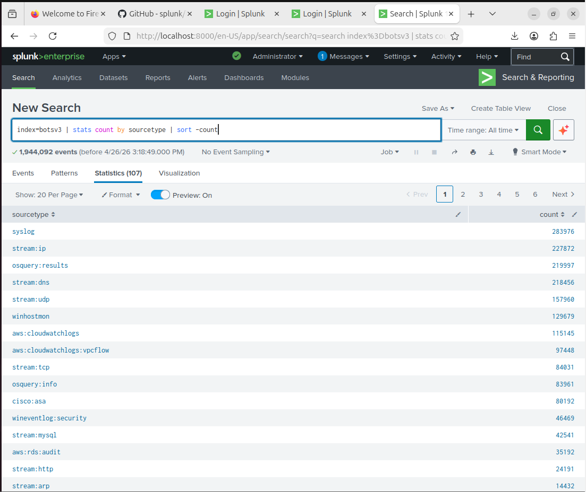
 
---
 
### Query 02 - Attack Timeline
 
**Investigative Question:** Is there a specific time window where activity spiked abnormally?
 
```spl
index=botsv3
| bucket _time span=1h
| stats count by _time
| sort -count
```
 
**Findings:**
- Attack date confirmed to be August 20, 2018
- Before the attack, activity was nearly silent (under 300 events/hour from 00:00 to 04:00)
- Activity exploded at 05:00 with 371,193 events
- Two distinct spikes in activity at 05:00-07:00 and 09:00-11:00
- There was likely a phase transition at the 08:00 gap (37,844 events)
  
**Note:** Activity spiked across the whole environment. The CoinMiner attack happened within these windows but does not account for all of the activity observed.
 
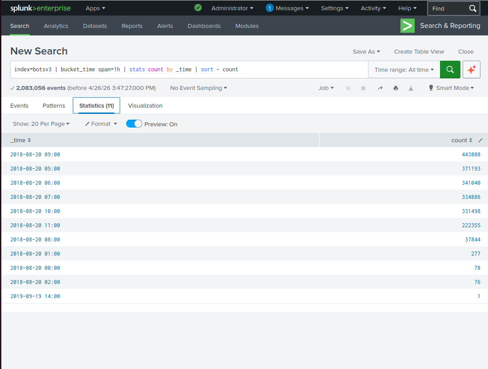
 
---
 
### Query 03 - Sourcetype Breakdown During Attack Window
 
**Investigative Question:** What kind of activity caused the spike?
 
```spl
index=botsv3 earliest="08/20/2018:05:00:00" latest="08/20/2018:12:00:00"
| bucket _time span=1h
| stats count by _time, sourcetype
| sort -count
```
 
**Findings:**
- Four sourcetypes fired at 05:00, suggesting coordinated multi-layer activity
- Beaconing behavior observed with stream:dns appearing across every attack hour
- PerfmonMk:Process spiked at 09:00 with 54,767 events, indicating heavy CPU on Windows endpoints
- Cloud activity escalated, aws:cloudwatchlogs spiked at 11:00 (114,913) 
  
**Two priority leads identified:** DNS beaconing patterns and Windows CPU pressure.
 
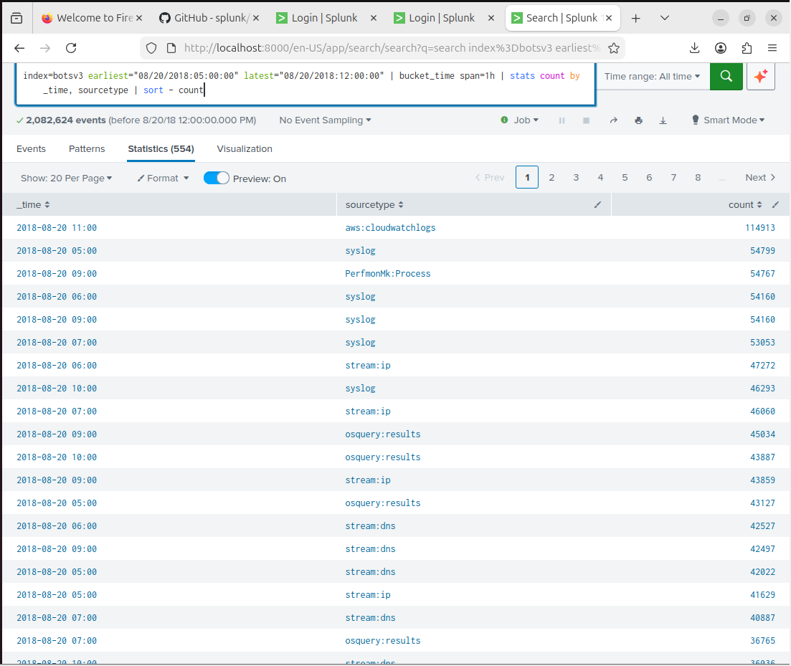
 
---
 
## Phase 2 - Network Activity Analysis
 
### Query 04 - DNS Domain Analysis
 
**Investigative Question:** What domains was this network querying during the attack window?
 
```spl
index=botsv3 sourcetype="stream:dns"
earliest="08/20/2018:05:00:00" latest="08/20/2018:12:00:00"
| stats count by query
| sort -count
```
 
**Findings:**
- 218,456 DNS events across 3,984 unique domains
- splunk.froth.ly was queried 5,684 times, far above any other domain
- All other top domains were normal corporate traffic (Microsoft, Google, Office365)
  
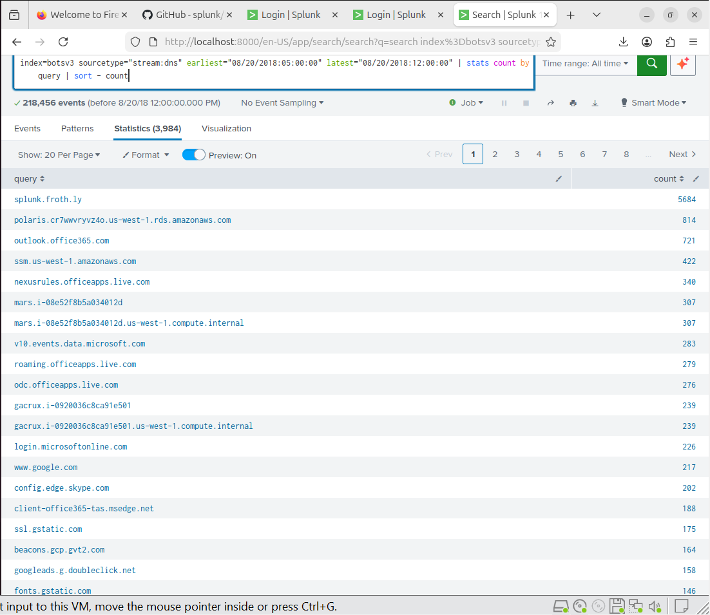
 
---
 
### Query 05 - Hosts Querying splunk.froth.ly
 
**Investigative Question:** Which machines were responsible for the 5,684 queries?
 
**Analyst Note:** Initial query used `src` field which returned no results. Pivoted to `host` field after raw event inspection revealed the source IP is stored in the host field for `stream:dns` in this dataset.
 
```spl
index=botsv3 sourcetype="stream:dns"
earliest="08/20/2018:05:00:00" latest="08/20/2018:12:00:00"
query="splunk.froth.ly"
| stats count by host
| sort -count
```
 
**Findings:**
- 14 distinct hosts were querying splunk.froth.ly
- The counts were very similar across the 14 hosts which is a sign of automated beaconing
- Hosts include workstations and EC2 cloud infrastructure

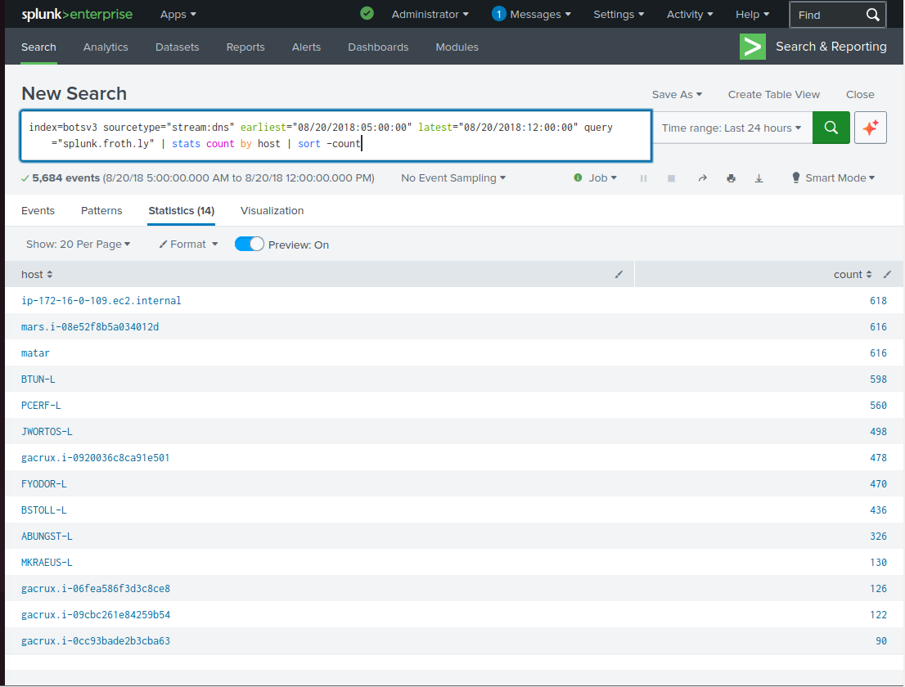
 
### splunk.froth.ly - Lead Outcome
 
While splunk.froth.ly initially appeared suspicious due to its very high query volume, my follow-up investigation did not connect this domain to the CoinMiner attack.
 
I pivoted from this lead to the second priority lead, the PerfmonMk:Process spike in Q03 which led me to uncover the actual mining activity on BSTOLL-L.
 
---
 
## Phase 3 - CPU Anomaly Investigation
 
### Query 06 - Hosts with PerfmonMk:Process Data
 
**Investigative Question:** Which Windows endpoint experienced abnormal CPU activity?
 
```spl
index=botsv3 sourcetype="PerfmonMk:Process"
earliest="08/20/2018:00:00:00" latest="08/20/2018:23:59:59"
| stats count by host
| sort -count
```
 
**Findings:**
- PerfmonMk:Process data only exists for BSTOLL-L with 864 events, with no events on other hosts
- I identified BSTOLL-L as primary host of interest
  
**Visibility Note:** This is a real visibility gap in the environment. I cannot confirm whether other hosts also experienced CPU pressure because there was no process-level performance monitoring on them.

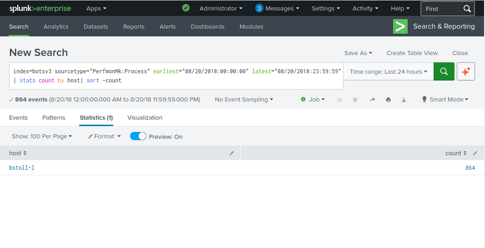
 
---
 
### Query 07 - BSTOLL-L Process CPU Analysis
 
**Investigative Question:** Which process on BSTOLL-L was consuming the most CPU?
 
```spl
index=botsv3 sourcetype="PerfmonMk:Process"
earliest="08/20/2018:00:00:00" latest="08/20/2018:23:59:59"
host="BSTOLL-L"
| stats max(%_Processor_Time) as max_cpu, avg(%_Processor_Time) as avg_cpu by instance
| sort -max_cpu
| head 20
```
 
**Findings:**
- Total CPU averaged 99.4% all day 
- Chrome browser tab was consuming abnormal CPU with 100% max, 22.9% average 
- Browser-based CPU at this level suggests malicious JavaScript execution
  
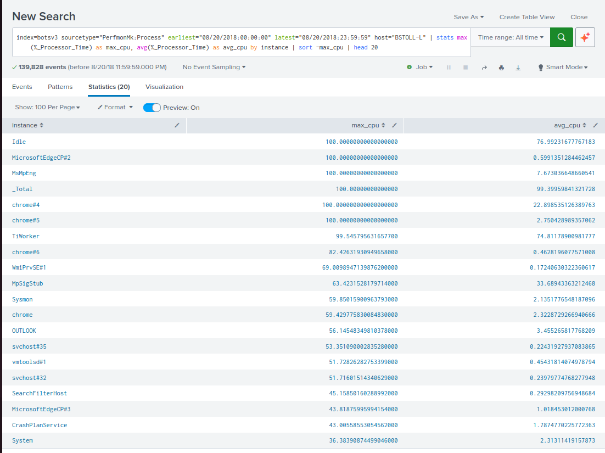
 
---
 
## Phase 4 - Payload Identification
 
### Query 08 - BSTOLL-L Browsing Destinations
 
**Investigative Question:** What websites was Chrome connecting to during the CPU spike?
 
```spl
index=botsv3 sourcetype="stream:http"
earliest="08/20/2018:00:00:00" latest="08/20/2018:23:59:59"
host="BSTOLL-L"
| stats count by site
| sort -count
| head 30
```
 
**Findings:**
- www.brewertalk.com was visited the most with 137 requests 
- Second-place was a normal certificate validation site (ocsp.digicert.com) with 42 requests 
- All the other destinations were normal corporate or personal browsing
  
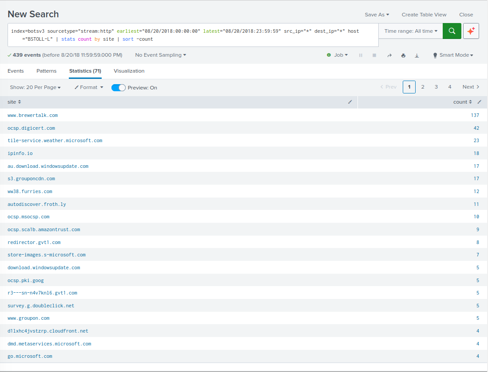
 
---
 
### Query 09 - BSTOLL-L Brewertalk Resources Loaded
 
**Investigative Question:** What specific resources was Chrome loading from brewertalk?
 
```spl
index=botsv3 sourcetype="stream:http"
earliest="08/20/2018:00:00:00" latest="08/20/2018:23:59:59"
host="BSTOLL-L" site="www.brewertalk.com"
| stats count by uri_path, http_method, status
| sort -count
```
 
**Findings:**
- Standard forum resources loaded: /forumdisplay.php, /showthread.php, /index.php, theme CSS, jQuery, forum images
- No obvious malicious filenames in URI paths
- Suggests malicious JavaScript was either embedded in legitimate-looking files or loaded from a third-party domain
  
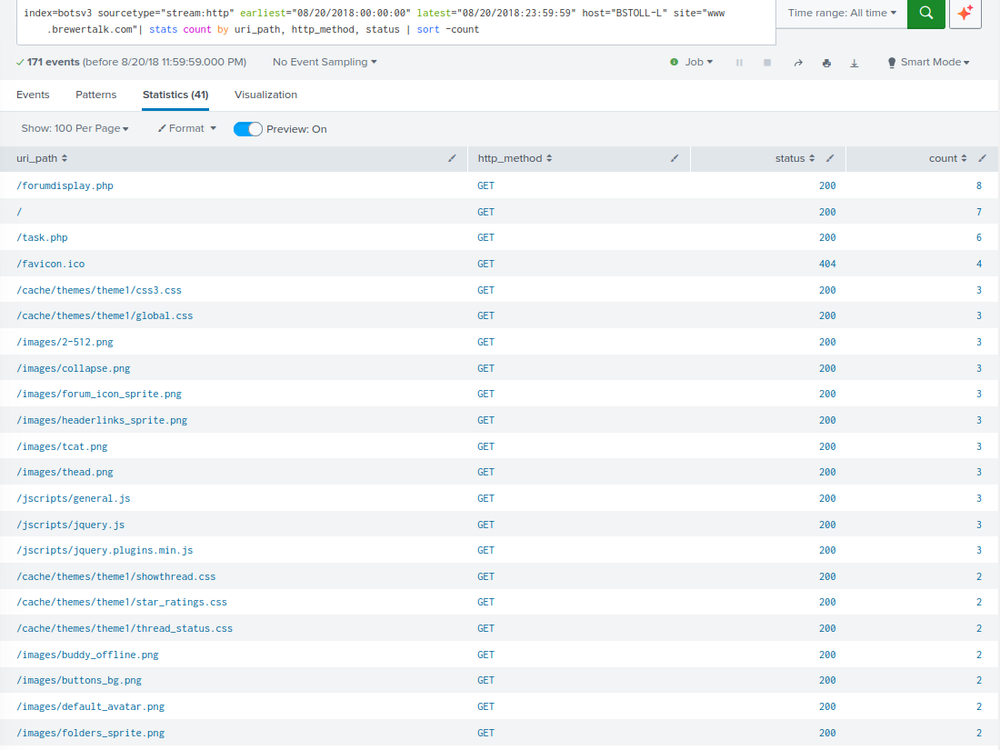
 
---
 
### Query 10 - BSTOLL-L's Full DNS Activity (Filtered)
 
**Investigative Question:** What other domains was BSTOLL-L's browser contacting during the CPU spike?

```spl
index=botsv3 sourcetype="stream:dns"
earliest="08/20/2018:00:00:00" latest="08/20/2018:23:59:59"
host="BSTOLL-L"
NOT (query="*.microsoft.com" OR query="*.google.com" OR query="*.googleapis.com"
     OR query="*.googleusercontent.com" OR query="*.gstatic.com" OR query="*.msedge.net"
     OR query="*.live.com" OR query="*.office.com" OR query="*.office365.com"
     OR query="*.officeapps.live.com" OR query="*.amazonaws.com" OR query="*.aws.amazon.com"
     OR query="*.cloudfront.net" OR query="*.azureedge.net" OR query="*.skype.com"
     OR query="*.bing.com" OR query="*.msn.com" OR query="*.sharepoint.com"
     OR query="*.sharepointonline.com" OR query="*.facebook.com" OR query="*.facebook.net"
     OR query="*.doubleclick.net" OR query="*.symantec.com" OR query="*.symantecliveupdate.com"
     OR query="*.digicert.com" OR query="*.froth.ly" OR query="ipinfo.io")
| stats count by query
| sort -count
```
 
**Findings:**
- Found Coinhive.com with 4 requests after filtering out known legitimate corporate domains
- CoinHive was a notorious cryptocurrency mining service used in drive-by compromises
- This is the smoking gun. BSTOLL-L had a CPU spike because of cryptocurrency mining
  
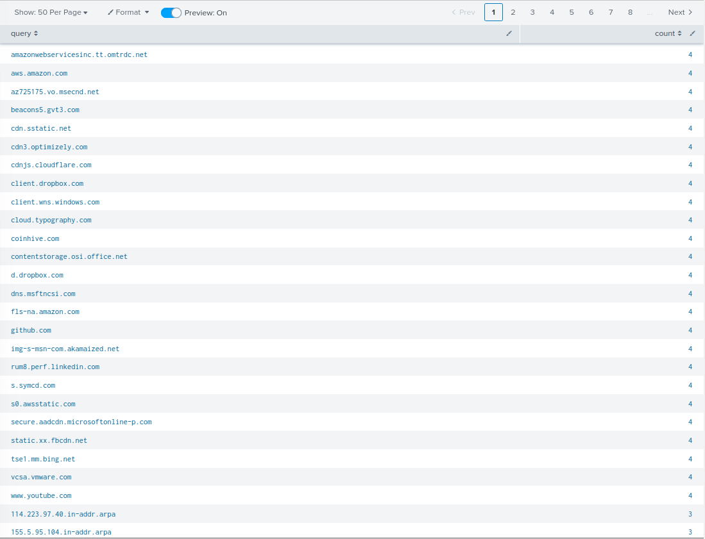
 
---
 
### Query 11 - CoinHive Connection Timeline
 
**Investigative Question:** When did BSTOLL-L first query coinhive.com?
 
```spl
index=botsv3 sourcetype="stream:dns"
earliest="08/20/2018:00:00:00" latest="08/20/2018:23:59:59"
host="BSTOLL-L" query="coinhive.com"
| table _time, host, query, src, dest
| sort _time
```
 
**Findings:**
- First coinhive.com DNS query was 2018-08-20 09:38:19
- Second query was at 09:39:20
- 4 total queries captured at two different timestamps just a minute apart, then no further DNS activity. This suggests a WebSocket establishing a persistent connection
  
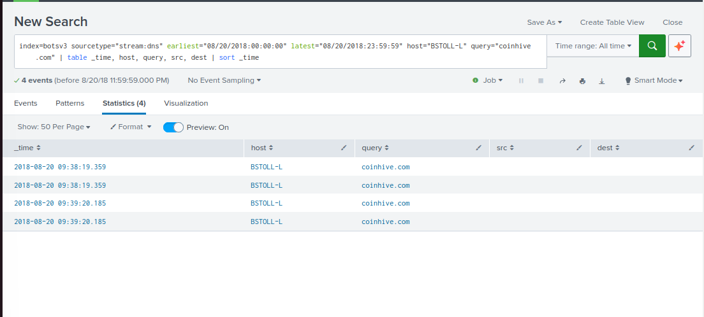
 
---
 
## Phase 5 - Detection Validation
 
### Query 12 - Symantec JSCoinminer Detections
 
**Investigative Question:** Did Symantec Endpoint Protection detect any malicious activity?
 
```spl
index=botsv3 sourcetype="symantec:ep:security:file"
earliest="08/20/2018:00:00:00" latest="08/20/2018:23:59:59"
| table _time, _raw
| sort _time
```
 
**Findings:**
- 46 Symantec detections of "Web Attack: JSCoinminer Download 6/8" - all blocked
- All 46 detections were on BTUN-L, not BSTOLL-L
- Affected application: Chrome
- User: BillyTun
- This confirmed brewertalk.com as the source of malicious content and JSCoinminer as the malware
 
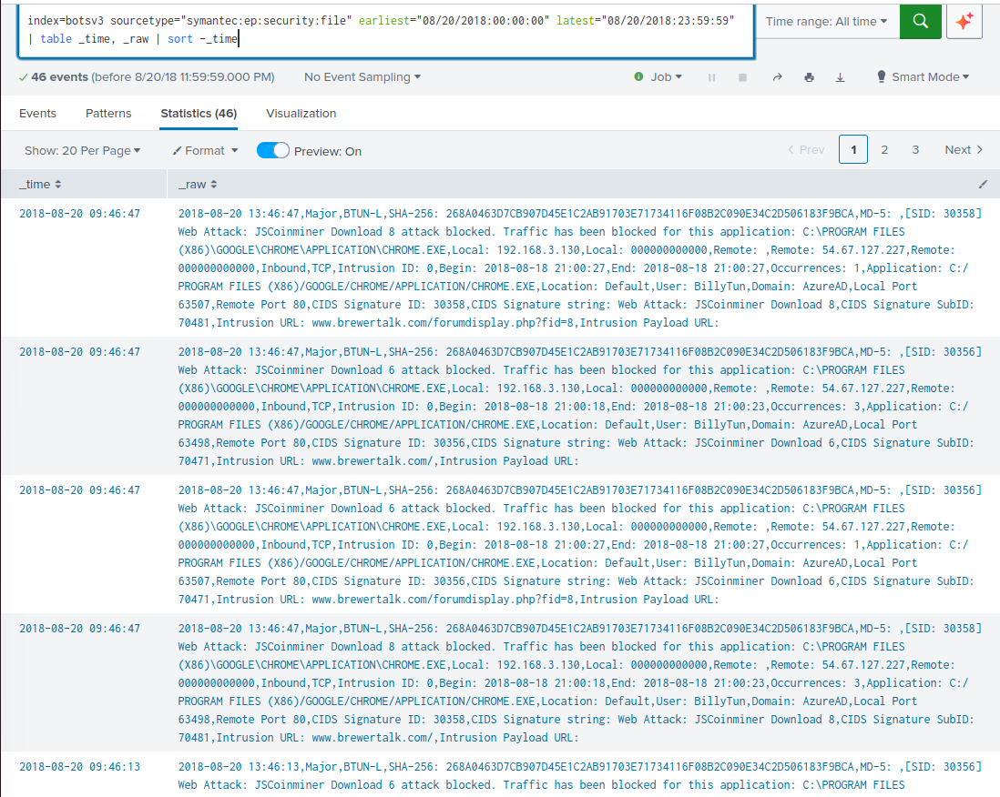

 ---
 
### Query 13 - Brewertalk Compromise Scope

**Investigative Question:** How widespread was the malicious content on brewertalk.com?

```spl
index=botsv3 sourcetype="symantec:ep:security:file"
earliest="08/20/2018:00:00:00" latest="08/20/2018:23:59:59"
JSCoinminer
| rex field=_raw "Intrusion URL: (?<intrusion_url>[^,]+)"
| stats count by intrusion_url
| sort -count
```
**Findings:**
- 10 unique brewertalk URLs served the malicious script
- Affected pages included the homepage, multiple forum categories (fid=5, 7, 8, 9, 11), thread pages, and attachments
- This was a site-wide compromise of brewertalk, not isolated page injection

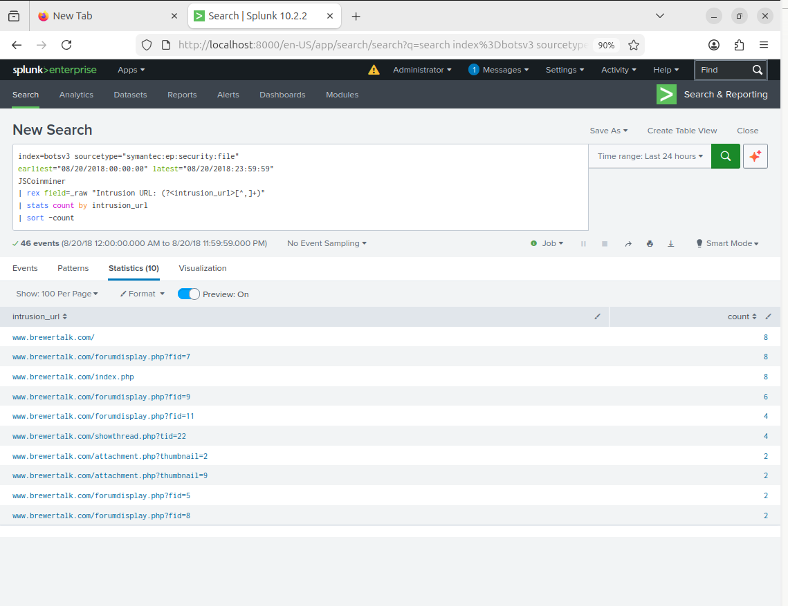
  
---
 
### Query 14 - Symantec Detection Coverage on BSTOLL-L
 
**Investigative Question:** Did Symantec detect anything on BSTOLL-L?
 
```spl
index=botsv3 sourcetype="symantec:ep:security:file"
earliest="08/20/2018:00:00:00" latest="08/20/2018:23:59:59"
BSTOLL-L
| table _time, _raw
| sort _time
```
 
**Findings:**
- Zero Symantec detections for BSTOLL-L despite having similar exposure to the attack vector
- Either Symantec was not running, signatures were outdated, or it was failing silently
- This explains why BSTOLL-L was the actual mining victim while BTUN-L was protected
  
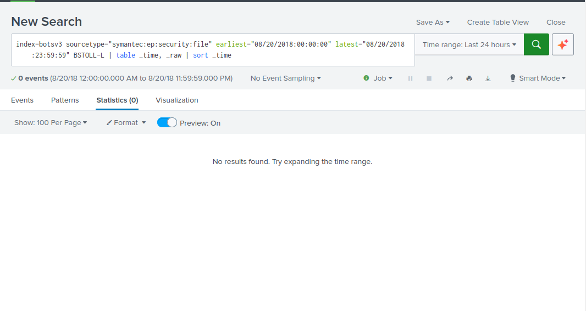
 
---
 
### Query 15 - CoinHive Query Scope Validation
 
**Investigative Question:** Did any other host query coinhive.com?
 
```spl
index=botsv3 sourcetype="stream:dns"
earliest="08/20/2018:00:00:00" latest="08/20/2018:23:59:59"
query="coinhive.com"
| stats count by host
| sort -count
```
 
**Findings:**
- Only BSTOLL-L queried coinhive.com, no other host did
- Confirms BSTOLL-L was the only successful mining victim
  
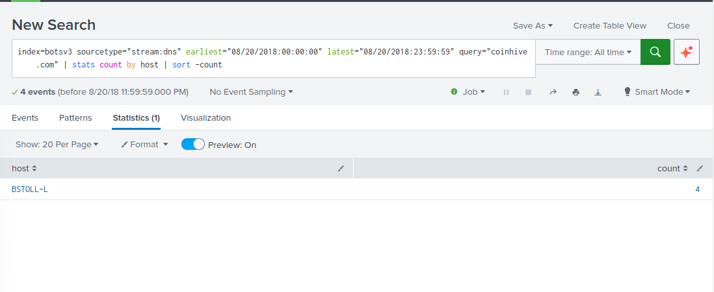
 
---
 
## Phase 6 - Timeline Reconstruction
 
### Query 16 - First Brewertalk Visit on BSTOLL-L
 
**Investigative Question:** When did BSTOLL-L first visit brewertalk?
 
```spl
index=botsv3 sourcetype="stream:http"
earliest="08/20/2018:00:00:00" latest="08/20/2018:23:59:59"
host="BSTOLL-L" site="www.brewertalk.com"
| table _time, host, site, uri_path
| sort _time
| head 5
```
 
**Findings:** First HTTP request to brewertalk was on 2018-08-20 09:07:23
 
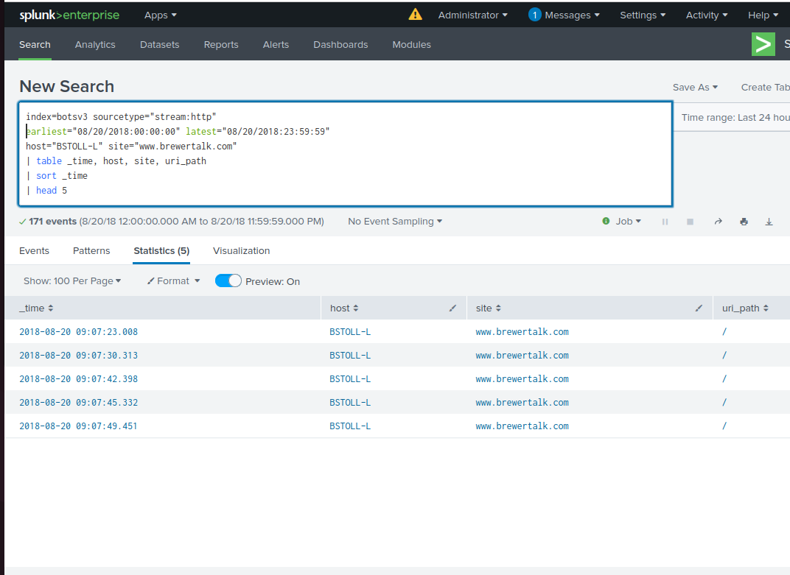
 
---
 
### Query 17 - Symantec First Detection Timeline
 
**Investigative Question:** When did Symantec first detect JSCoinminer?
 
```spl
index=botsv3 sourcetype="symantec:ep:security:file"
earliest="08/20/2018:00:00:00" latest="08/20/2018:23:59:59"
JSCoinminer
| table _time, _raw
| sort _time
| head 5
```
 
**Findings:** First JSCoinminer block on BTUN-L was 2018-08-20 09:37:40
 
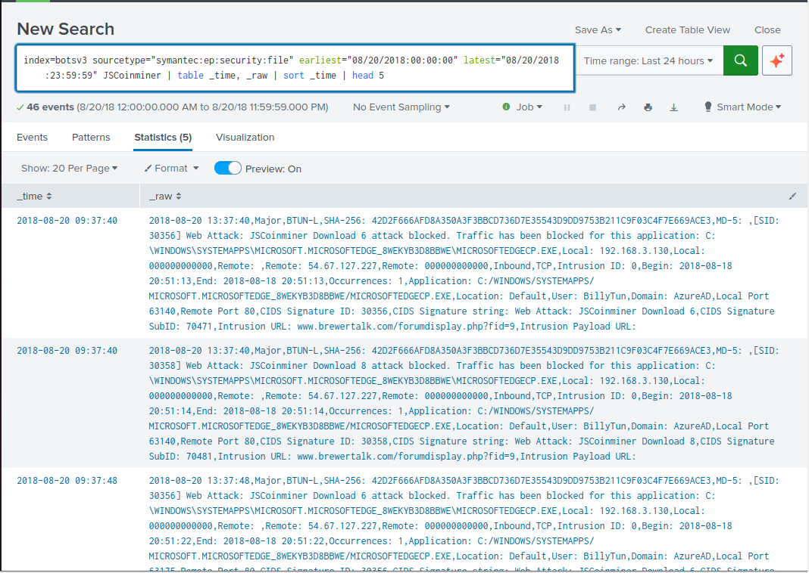
 
---
 
### Query 18 - Chrome CPU Timeline on BSTOLL-L (Precise)
 
**Investigative Question:** When did Chrome's CPU climb to 100% and how long did the mining sustain?
 
```spl
index=botsv3 sourcetype="PerfmonMk:Process"
earliest="08/20/2018:09:00:00" latest="08/20/2018:11:30:00"
host="BSTOLL-L" instance=*chrome*
%_Processor_Time>=99
| table _time, instance, %_Processor_Time
| sort _time
```
 
**Findings:**
- 132 total events at 99-100% CPU (131 in the sustained mining session plus 1 isolated event at 10:59:19)
- First mining event: 2018-08-20 09:37:50 (chrome#5)
- Sustained mining session: 09:37:50 to 10:04:11 (~26 minutes)
- Final isolated event: 10:59:19
- No further mining activity for the remainder of the day
  
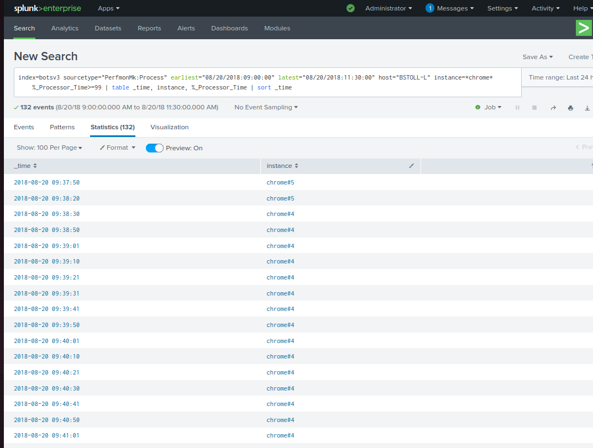
 
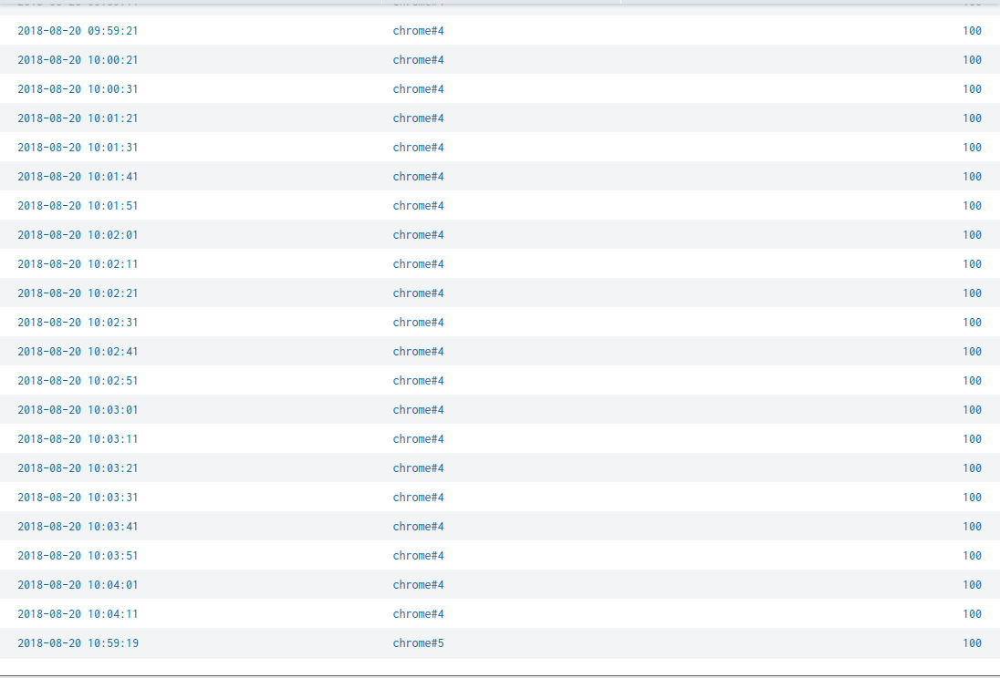
 
---

### Query 19 - Chrome CPU Pattern Visualization
 
**Investigative Question:** What does the full Chrome CPU pattern look like across the attack window?
 
**Reasoning:** Q18 captured precise timestamps of high-CPU events (>=99%) but doesn't show the broader pattern including baseline activity. Visualizing the unfiltered data reveals the contrast between normal CPU and mining periods.
 
```spl
index=botsv3 sourcetype="PerfmonMk:Process"
earliest="08/20/2018:09:00:00" latest="08/20/2018:11:30:00"
host="BSTOLL-L" instance=*chrome*
| table _time, instance, %_Processor_Time
| sort _time
```
 
**Findings:**
- The mining session shows up as a dense block of sustained 100% CPU between baseline activity
- The brief 10:59:19 spike stands out clearly as an isolated event after mining stopped
  
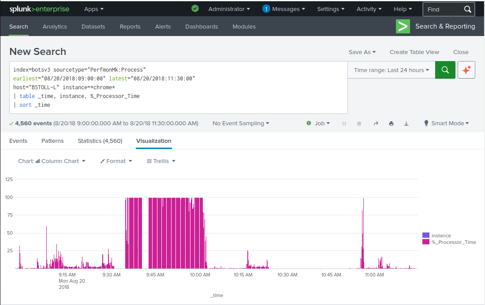

 ---
 
## Complete Attack Timeline
 
| Time | BSTOLL-L (Chrome) | BTUN-L (Chrome and Edge) | Significance |
|---|---|---|---|
| 09:07:23 | First visit to brewertalk.com | - | Compromise begins on BSTOLL-L |
| **09:37:40** | - | **First Symantec block of JSCoinminer** | Defense succeeds on protected host |
| **09:37:50** | **Chrome hits 100% CPU - mining begins** | - | Mining payload begins executing |
| **09:38:19** | First coinhive.com DNS query | - | Mining script connects to pool |
| 09:39:20 | Additional coinhive.com queries (4 total) | - | Mining handshake complete |
| 09:37:50 - 10:04:11 | Sustained 100% CPU mining (~26 minutes, 131 events) | Symantec blocks 46 attempts | Peak attack window |
| 10:04:11 | Last 100% CPU event of primary mining session | - | Mining session ends |
| 10:04 - 10:59 | Chrome CPU drops to baseline | - | Mining inactive |
| **10:59:19** | **Brief CPU spike to 100%** | - | Single isolated mining event |
 
---
 
## Key Correlations Proven by the Data
 
**CPU spike correlates with brewertalk visits.** Chrome CPU was at baseline (under 1%) prior to brewertalk activity. CPU climbed during browsing and hit 100% during sustained brewertalk activity.
 
**Same attack, different outcomes.** Symantec on BTUN-L blocked the JSCoinminer attempt at 09:37:40. 10 seconds later, Chrome on BSTOLL-L hit 100% CPU and began mining. 39 seconds after Symantec's block, BSTOLL-L's browser successfully connected to CoinHive infrastructure. Two machines were attacked by the same vector but had opposite outcomes due to detection coverage gaps.
 
**Mining duration was 26 minutes.** From 09:37:50 to 10:04:11, Chrome on BSTOLL-L sustained near-continuous 100% CPU usage with 131 logged events.
 
---
 
## Phase 7 - Framework Mapping
 
### MITRE ATT&CK
 
| Technique | Tactic | Evidence |
|---|---|---|
| **T1189** Drive-by Compromise | Initial Access | Symantec logs identified multiple URLs as the intrusion sources, indicating site-wide compromise (Q12, Q13) |
| **T1059.007** Command and Scripting Interpreter: JavaScript | Execution | Symantec signature "JSCoinminer Download" confirmed JavaScript-based payload executing in Chrome browser (Q12) |
| **T1071.001** Application Layer Protocol: Web Protocols | Command and Control | DNS query to known C2 domain coinhive.com (Q11) combined with sustained mining activity (Q18) indicates the JSCoinminer payload established C2-communication with mining pool infrastructure. Direct WebSocket traffic was not captured in the dataset's HTTP logs but is inferable from the activity pattern. |
| **T1496** Resource Hijacking | Impact | PerfmonMk:Process showed Chrome on BSTOLL-L sustained 100% CPU during attack window (Q07, Q18, Q19) |
 
### NIST Cybersecurity Framework
 
| Function | Subcategory | Evidence |
|---|---|---|
| **Detect (DE.AE)** Anomalies and Events | DE.AE-2 - Detected events analyzed to understand attack targets | Q03 surfaced PerfmonMk and DNS anomalies; Q04-Q05 traced DNS beaconing scope; Q07 identified abnormal CPU |
| **Detect (DE.CM)** Security Continuous Monitoring | DE.CM-4 - Malicious code is detected | Symantec EP detected 46 JSCoinminer attempts on BTUN-L (Q12) |
| **Respond (RS.AN)** Analysis | RS.AN-1 - Notifications from detection systems are investigated | This investigation traced the complete attack chain using log data across multiple sourcetypes |
 
### NIST 800-53 Controls
 
| Control | Evidence |
|---|---|
| **SI-3** Malicious Code Protection | Symantec EP successfully blocked malicious code on BTUN-L. Detection gap on BSTOLL-L allowed mining to proceed (Q12, Q14) |
| **SI-4** System Monitoring | PerfmonMk:Process, stream:dns, stream:http, and Symantec sourcetypes provided the visibility necessary to reconstruct the attack |
 
### CIS Controls v8
 
| Control | Evidence |
|---|---|
| **Control 8** Audit Log Management | Investigation was made possible by properly retained logs across DNS, HTTP, endpoint performance, and security tooling |
| **Control 9** Email and Web Browser Protections | Drive-by compromise occurred through web browser; the malicious script ran inside Chrome on BSTOLL-L without blocking |
| **Control 10** Malware Defenses | Symantec EP partially effective - protection worked on BTUN-L, failed on BSTOLL-L (Q12, Q14) |
| **Control 13** Network Monitoring and Defense | DNS-level monitoring captured the coinhive.com query that confirmed C2-equivalent communication (Q11) |
 
---
 
## Key Findings
 
1. **Brewertalk.com served malicious JSCoinminer JavaScript** - confirmed by Symantec naming the URL as the intrusion source
2. **BSTOLL-L was the actual mining victim** - sustained 100% CPU for 26 minutes, coinhive.com DNS confirmed, no Symantec protection
3. **BTUN-L was successfully protected** - Symantec blocked 46 attempts at the same attack vector
4. **A detection coverage gap on BSTOLL-L** enabled the mining attack to succeed
---
 
## Investigative Challenges & Pivots
 
This section documents the pivots I made during the investigation.
 
- **stream:dns source field issue** - `src` field was empty so I used `host` field instead after checking raw events.
- **PerfmonMk visibility gap** - Process performance data was only collected on BSTOLL-L. Other endpoints could not be assessed for similar CPU anomalies.
- **Multiple investigative threads** - DNS beaconing and CPU pressure were both followed. The DNS lead (splunk.froth.ly) did not connect to the CoinMiner attack. The CPU lead led directly to the mining activity and BSTOLL-L.
---
 
## Recommendations
 
1. **Address Symantec coverage gap on BSTOLL-L** - Investigate why JSCoinminer was not detected and ensure consistent protection across all endpoints
2. **Deploy uniform endpoint performance monitoring** - PerfmonMk should collect from all Windows endpoints, not just BSTOLL-L
3. **Block known cryptocurrency mining domains** - Implement DNS-layer blocking for coinhive.com and similar mining infrastructure
4. **User awareness training** - Educate employees on drive-by compromise risks, even on trusted industry websites
5. **Web filtering** - Consider URL filtering for content categories that present elevated risk
6. **Incident response runbook** - Create documented procedure for cryptomining detection and response
---
 
## Repository Contents
 
- `README.md` - This investigation narrative with embedded SPL queries and screenshots
- `IOCs.md` - Indicators of compromise from this investigation
- `screenshots/` - Visual evidence supporting each query
- `setup/` - Environment setup documentation
---
 
*Investigation conducted by Umu Jalloh*
*Cybersecurity & Computer Forensics Student | Stark State College*
*Cybersecurity Intern, Ohio Cyber Range Institute*
*CompTIA Security+ | CompTIA Network+*
